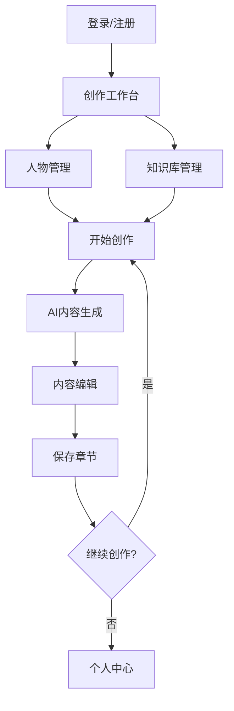

## 1. 产品概述
这是一个基于大模型的智能小说创作平台，帮助作者高效创作小说内容。通过AI技术自动生成章节和段落，同时提供人物管理和知识库功能，让创作过程更加流畅和专业。

目标用户包括网络小说作者、创意写作爱好者、内容创作者等需要高效产出文学作品的人群。

## 2. 核心功能

### 2.1 用户角色
| 角色 | 注册方式 | 核心权限 |
|------|----------|----------|
| 普通用户 | 邮箱注册 | 基础创作、人物管理、知识库使用 |
| 高级用户 | 付费升级 | 无限创作、高级AI模型、导出功能 |

### 2.2 功能模块
本小说创作平台包含以下核心页面：
1. **创作工作台**：小说项目管理、章节列表、实时创作界面
2. **人物管理页**：人物信息录入、关系图谱、性格特征管理
3. **知识库管理页**：文件上传、知识整理、AI学习配置
4. **个人中心**：用户设置、作品统计、订阅管理

### 2.3 页面详情
| 页面名称 | 模块名称 | 功能描述 |
|----------|----------|----------|
| 创作工作台 | 项目管理 | 创建新小说、查看已有作品、设置小说类型和风格 |
| 创作工作台 | 章节生成 | 输入创作要求、AI自动生成章节内容、支持多次迭代优化 |
| 创作工作台 | 段落创作 | 针对具体场景生成详细段落、调整文风语调、插入对话描写 |
| 人物管理页 | 人物录入 | 手动添加人物基本信息、AI自动提取人物特征、批量导入 |
| 人物管理页 | 关系管理 | 可视化展示人物关系、设置人物间互动关系、关系变化追踪 |
| 人物管理页 | 性格档案 | 记录人物性格特点、成长轨迹、重要事件影响 |
| 知识库管理页 | 文件上传 | 支持PDF、TXT、DOCX格式、批量上传、自动解析 |
| 知识库管理页 | 知识分类 | 自定义知识标签、内容分类管理、检索优化 |
| 知识库管理页 | AI配置 | 设置知识库权重、选择参考范围、更新学习模型 |
| 个人中心 | 用户设置 | 修改个人信息、创作偏好设置、通知管理 |
| 个人中心 | 作品统计 | 创作字数统计、完成进度、AI使用次数 |
| 个人中心 | 订阅管理 | 查看会员权益、升级订阅、支付管理 |

## 3. 核心流程
**用户创作流程**：
1. 用户登录后进入创作工作台
2. 创建新小说项目，设置基本信息
3. 在人物管理页录入主要人物信息
4. 上传相关参考资料到知识库
5. 在创作界面输入创作要求
6. AI根据人物设定和知识库生成内容
7. 用户对生成内容进行编辑和优化
8. 保存章节，继续创作下一部分

## 4. 用户界面设计

### 4.1 设计风格
- **主色调**：深蓝色(#1e3a8a)搭配白色背景，营造专业创作氛围
- **辅助色**：金色(#f59e0b)用于强调和重要操作按钮
- **按钮样式**：圆角矩形设计，悬停效果，主要操作为实心填充
- **字体选择**：中文使用思源黑体，英文使用Inter，确保跨平台一致性
- **布局风格**：左侧导航栏+右侧主内容区，卡片式内容展示
- **图标风格**：使用线性图标，简洁现代，符合创作主题

### 4.2 页面设计概述
| 页面名称 | 模块名称 | UI元素 |
|----------|----------|--------|
| 创作工作台 | 导航栏 | 左侧固定宽度200px，包含logo、主要功能入口，当前选中项高亮显示 |
| 创作工作台 | 创作区 | 中央主要区域，采用分栏布局，左侧为输入区，右侧为AI生成内容展示区 |
| 创作工作台 | 工具栏 | 顶部工具栏包含字体设置、保存按钮、导出选项，采用扁平化设计 |
| 人物管理页 | 人物卡片 | 网格布局展示人物，每张卡片包含头像、姓名、关键信息，支持拖拽排序 |
| 人物管理页 | 关系图谱 | 使用力导向图展示人物关系，节点大小表示重要程度，连线粗细表示关系强度 |
| 知识库管理页 | 文件列表 | 表格形式展示上传文件，包含文件名、大小、上传时间、处理状态 |
| 知识库管理页 | 分类标签 | 标签云形式展示知识分类，支持多选过滤，颜色深浅表示使用频率 |

### 4.3 响应式设计
- **桌面优先**：默认设计为1920x1080分辨率，支持最小1366x768
- **移动端适配**：平板端采用自适应布局，手机端提供简化版界面
- **触摸优化**：按钮最小点击区域44x44px，支持手势操作
- **加载动画**：使用骨架屏和渐进式加载，提升用户体验

### 4.4 交互设计
- **实时保存**：每30秒自动保存创作内容，防止数据丢失
- **快捷键支持**：支持常用快捷键如Ctrl+S保存、Ctrl+Z撤销
- **拖拽上传**：支持拖拽文件到指定区域上传
- **智能提示**：输入时提供相关人物和知识库内容提示
- **进度反馈**：AI生成过程显示进度条和预计剩余时间