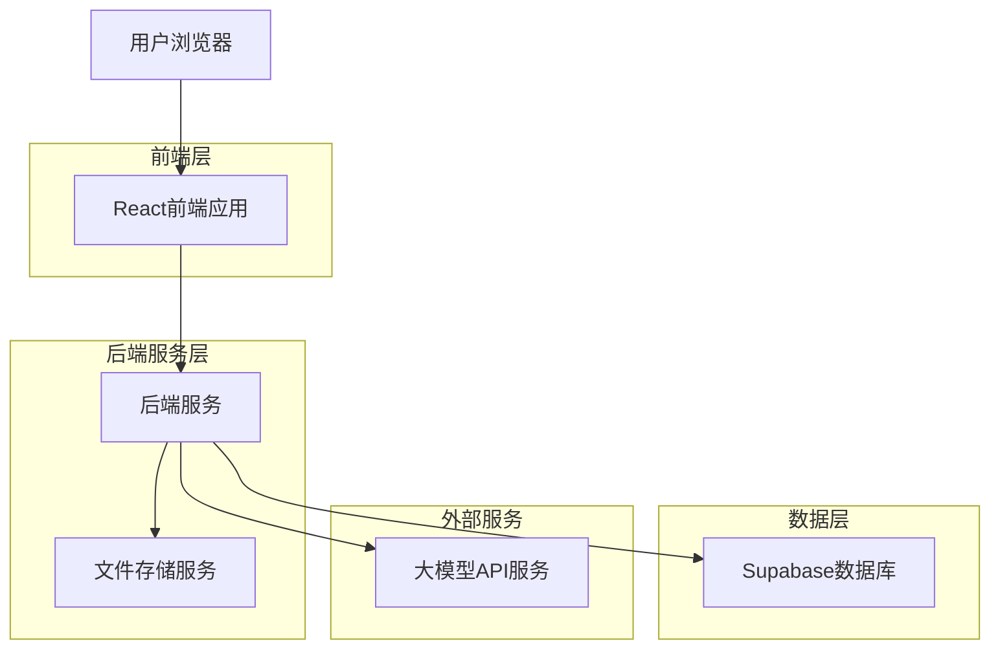
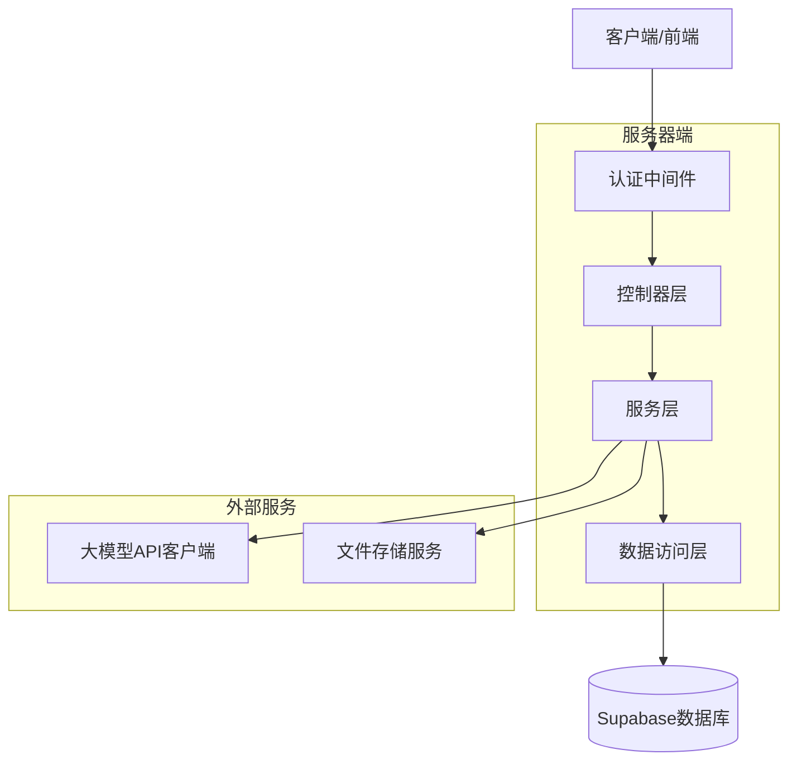
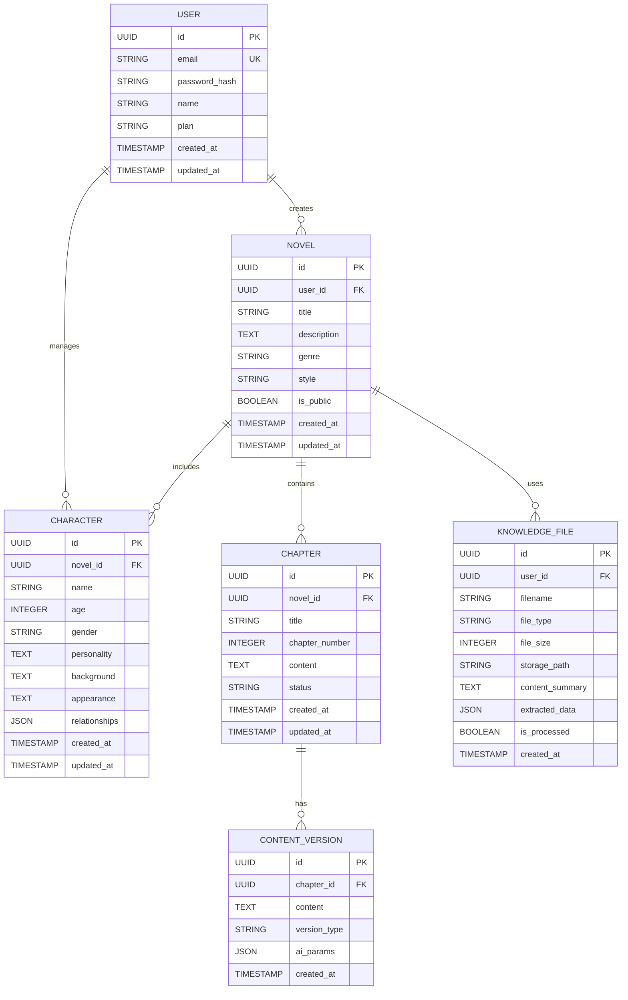

## 1. 架构设计



## 2. 技术栈描述
- **前端**: React@18 + TypeScript@5 + TailwindCSS@3 + Vite
- **初始化工具**: vite-init
- **后端**: Node.js@20 + Express@4 + TypeScript
- **数据库**: Supabase (PostgreSQL)
- **文件存储**: Supabase Storage
- **AI服务**: OpenAI GPT-4 API / 百度文心一言 API
- **状态管理**: Zustand
- **UI组件**: Ant Design@5 + 自定义组件
- **图表库**: ECharts@5 (人物关系图谱)
- **富文本编辑器**: Quill.js

## 3. 路由定义
| 路由 | 用途 |
|-------|---------|
| / | 登录页，用户身份验证 |
| /dashboard | 创作工作台，主要创作界面 |
| /characters | 人物管理页，管理小说人物 |
| /knowledge | 知识库管理页，上传和管理参考资料 |
| /profile | 个人中心，用户设置和统计 |
| /novel/:id | 具体小说项目的创作页面 |
| /novel/:id/chapter/:chapterId | 章节编辑页面 |

## 4. API定义

### 4.1 用户认证相关
```
POST /api/auth/login
```

请求参数：
| 参数名 | 参数类型 | 是否必需 | 描述 |
|-----------|-------------|-------------|-------------|
| email | string | true | 用户邮箱 |
| password | string | true | 用户密码 |

响应：
| 参数名 | 参数类型 | 描述 |
|-----------|-------------|-------------|
| token | string | JWT认证令牌 |
| user | object | 用户信息 |

### 4.2 小说管理相关
```
GET /api/novels
POST /api/novels
GET /api/novels/:id
PUT /api/novels/:id
DELETE /api/novels/:id
```

### 4.3 AI内容生成
```
POST /api/ai/generate-chapter
POST /api/ai/generate-paragraph
POST /api/ai/optimize-content
```

请求示例：
```json
{
  "novelId": "uuid",
  "prompt": "生成一段关于主角在森林中迷路的描写",
  "characters": ["主角A", "配角B"],
  "style": "悬疑紧张",
  "wordCount": 500
}
```

### 4.4 人物管理相关
```
GET /api/characters
POST /api/characters
PUT /api/characters/:id
DELETE /api/characters/:id
GET /api/characters/relations
```

### 4.5 知识库管理
```
POST /api/knowledge/upload
GET /api/knowledge/files
DELETE /api/knowledge/files/:id
POST /api/knowledge/process
```

## 5. 服务器架构图



## 6. 数据模型

### 6.1 数据模型定义


### 6.2 数据定义语言

**用户表 (users)**
```sql
-- 创建表
CREATE TABLE users (
  id UUID PRIMARY KEY DEFAULT gen_random_uuid(),
  email VARCHAR(255) UNIQUE NOT NULL,
  password_hash VARCHAR(255) NOT NULL,
  name VARCHAR(100) NOT NULL,
  plan VARCHAR(20) DEFAULT 'free' CHECK (plan IN ('free', 'premium')),
  created_at TIMESTAMP WITH TIME ZONE DEFAULT NOW(),
  updated_at TIMESTAMP WITH TIME ZONE DEFAULT NOW()
);

-- 创建索引
CREATE INDEX idx_users_email ON users(email);
CREATE INDEX idx_users_plan ON users(plan);
```

**小说表 (novels)**
```sql
-- 创建表
CREATE TABLE novels (
  id UUID PRIMARY KEY DEFAULT gen_random_uuid(),
  user_id UUID NOT NULL REFERENCES users(id) ON DELETE CASCADE,
  title VARCHAR(255) NOT NULL,
  description TEXT,
  genre VARCHAR(50),
  style VARCHAR(50),
  is_public BOOLEAN DEFAULT false,
  created_at TIMESTAMP WITH TIME ZONE DEFAULT NOW(),
  updated_at TIMESTAMP WITH TIME ZONE DEFAULT NOW()
);

-- 创建索引
CREATE INDEX idx_novels_user_id ON novels(user_id);
CREATE INDEX idx_novels_genre ON novels(genre);
```

**章节表 (chapters)**
```sql
-- 创建表
CREATE TABLE chapters (
  id UUID PRIMARY KEY DEFAULT gen_random_uuid(),
  novel_id UUID NOT NULL REFERENCES novels(id) ON DELETE CASCADE,
  title VARCHAR(255) NOT NULL,
  chapter_number INTEGER NOT NULL,
  content TEXT,
  status VARCHAR(20) DEFAULT 'draft' CHECK (status IN ('draft', 'published', 'archived')),
  created_at TIMESTAMP WITH TIME ZONE DEFAULT NOW(),
  updated_at TIMESTAMP WITH TIME ZONE DEFAULT NOW()
);

-- 创建索引
CREATE INDEX idx_chapters_novel_id ON chapters(novel_id);
CREATE INDEX idx_chapters_status ON chapters(status);
```

**人物表 (characters)**
```sql
-- 创建表
CREATE TABLE characters (
  id UUID PRIMARY KEY DEFAULT gen_random_uuid(),
  novel_id UUID NOT NULL REFERENCES novels(id) ON DELETE CASCADE,
  name VARCHAR(100) NOT NULL,
  age INTEGER,
  gender VARCHAR(10),
  personality TEXT,
  background TEXT,
  appearance TEXT,
  relationships JSONB DEFAULT '[]',
  created_at TIMESTAMP WITH TIME ZONE DEFAULT NOW(),
  updated_at TIMESTAMP WITH TIME ZONE DEFAULT NOW()
);

-- 创建索引
CREATE INDEX idx_characters_novel_id ON characters(novel_id);
CREATE INDEX idx_characters_name ON characters(name);
```

**知识库文件表 (knowledge_files)**
```sql
-- 创建表
CREATE TABLE knowledge_files (
  id UUID PRIMARY KEY DEFAULT gen_random_uuid(),
  user_id UUID NOT NULL REFERENCES users(id) ON DELETE CASCADE,
  filename VARCHAR(255) NOT NULL,
  file_type VARCHAR(50) NOT NULL,
  file_size INTEGER NOT NULL,
  storage_path VARCHAR(500) NOT NULL,
  content_summary TEXT,
  extracted_data JSONB,
  is_processed BOOLEAN DEFAULT false,
  created_at TIMESTAMP WITH TIME ZONE DEFAULT NOW()
);

-- 创建索引
CREATE INDEX idx_knowledge_files_user_id ON knowledge_files(user_id);
CREATE INDEX idx_knowledge_files_is_processed ON knowledge_files(is_processed);
```

**Supabase访问权限设置**
```sql
-- 授予匿名用户基本读取权限
GRANT SELECT ON novels TO anon;
GRANT SELECT ON chapters TO anon;
GRANT SELECT ON characters TO anon;

-- 授予认证用户完整权限
GRANT ALL PRIVILEGES ON novels TO authenticated;
GRANT ALL PRIVILEGES ON chapters TO authenticated;
GRANT ALL PRIVILEGES ON characters TO authenticated;
GRANT ALL PRIVILEGES ON knowledge_files TO authenticated;

-- 创建行级安全策略
ALTER TABLE novels ENABLE ROW LEVEL SECURITY;
ALTER TABLE chapters ENABLE ROW LEVEL SECURITY;
ALTER TABLE characters ENABLE ROW LEVEL SECURITY;
ALTER TABLE knowledge_files ENABLE ROW LEVEL SECURITY;

-- 创建策略
CREATE POLICY "用户只能看到自己的小说" ON novels
  FOR ALL USING (auth.uid() = user_id);

CREATE POLICY "用户只能看到自己的章节" ON chapters
  FOR ALL USING (auth.uid() IN (SELECT user_id FROM novels WHERE id = novel_id));

CREATE POLICY "用户只能看到自己的人物" ON characters
  FOR ALL USING (auth.uid() IN (SELECT user_id FROM novels WHERE id = novel_id));

CREATE POLICY "用户只能看到自己的知识库文件" ON knowledge_files
  FOR ALL USING (auth.uid() = user_id);
```